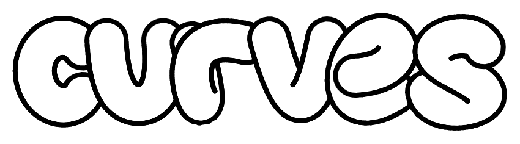

A small Bezier curve editor built with p5.js

live here: [projects.dimitri.ge/curves](https://projects.dimitri.ge/curves)

## Running locally

to run the dev server: `npm run dev`

## The idea behind this

Okay, this is probably gonna sound kinda ridiculous or maybe really cool, depending on where you are comming from, but the idea for this project is as follows: A simple website, where mortals can visit, create custom designs of curvy text and... **curves**, and then they would be able to have the designs they created printed as stickers, rendered at high resolution for use as a wallpaper, and maybe integrate this with [enveloper](https://github.com/D-T-666/enveloper) so they can have envelopes with completely custom designs printed.

## OMG MAKE MOENY?

The thing is, my father runs a local print shop. So I would be able to have a *service*, where people would easily get their stickers andor envelopes printed. I would charge them in cash, and they would pick the prints up at our shop. The problem is, the paper we usually print on is not really suitable for stickers, since it's not really durable. So the plan is to have the stickers printed in the capital city of Georgia, where they can print on actual sticker paper. The problem though, is that they don't print in low quantities. So I'd have to queue up orders, and then have them printed in bulk. This introduces a few, quite undesirable quirks. By my estimate, on average, people would have to wait 1-3 weeks for their orders, and that's assuming that there'll be some quite big amount of stickers to be printed at all. If there will not be enough orders, then there's no point to printing any at all, since the price would go up a lot, and nobody wants that. Plus, the shipping, the packaging, marketing, and other stuff would cost a lot more than what I'd gain.

But here I am, still planning to do it at some point! All you gotta do is wish me luck, and maybe help out a little, this is an open source project after all ¯\\\_(ツ)\_/¯

---

## To do

- [x] moving, scaling, and rotating curves
- [x] editing curve anchors
  - [x] moving existing anchors around
  - [x] inserting anchors
- [x] switching between edit modes
- [ ] multiple curves
  - [x] UI
  - [x] functionality
    - [x] insertion/deletion/duplication
    - [x] rearrangement
  - [x] click select (should select the curve you click on the canvas)
  - [ ] * select multiple curves
    - [ ] UI
    - [ ] in-canvas
  - [ ] linking
    - [ ] curves
    - [ ] styles

- [ ] curve style modification
  - [ ] along-the-curve property editor
    - [ ] fill color, weight
    - [ ] stroke color, weight
    - [ ] repeating texture (image)
  - [ ] picking between kinds of curves [nth order Bezier, Cubic B-spline, Quadratic B-spline, ...]
  - [ ] curve render mode selection [thick, ribbon, ...]

- [ ] char creation
  - [ ] ability to specify the baseline
  - [ ] order of the anchors
  - [ ] bounding boxv